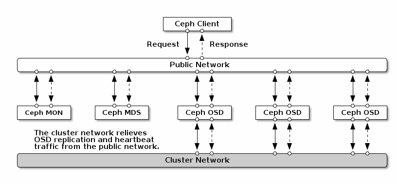

**Network**

Ceph cluster "phải" dùng một "public" (front side) network. Nếu chúng ta không chỉ định "cluster" (back side) network thì Ceph sẽ chỉ sử dụng "public" network.
Ceph hoàn toàn có thể vận hành chỉ với public network nhưng sẽ tối ưu hơn nếu chúng ta dùng cluster network ở hệ thống lớn.
Có thể dùng bond hoặc dùng nhiều NIC.

